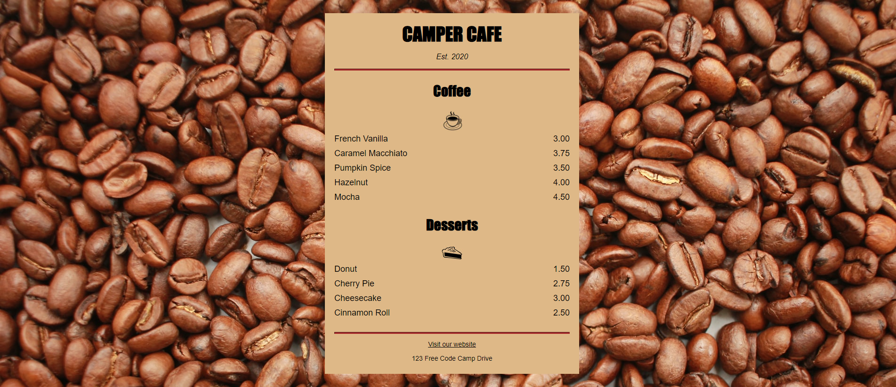

# CamperCafe

## Description
Responsive Web Design Practice

CSS tells the browser how to display your webpage. You can use CSS to set the color, font, size, and other aspects of HTML elements.

In this mini project, I review CSS by designing a menu page for a cafe webpage.

## Credits
Kevin Ng